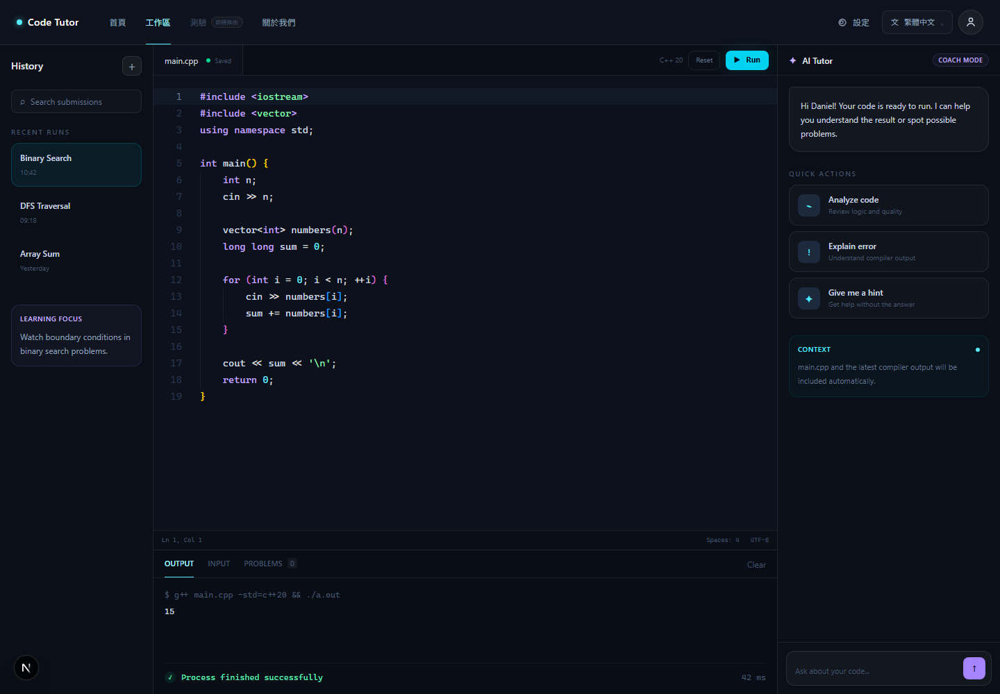

# Code Tutor

Code Tutor 是一個以程式設計學習為核心的 AI Agent。使用者可以在線上撰寫與執行 C++，並取得錯誤解釋、除錯建議與漸進式提示。

## MVP 功能

- 使用者帳號
- C++ 編輯器
- 編譯與執行
- Output / Error 顯示
- AI Analyze Code
- AI Explain Error
- AI Hint

## 預定技術

- Frontend: Next.js、React、Monaco Editor
- Backend: Python、FastAPI
- Database: PostgreSQL
- Compiler: Docker、g++
- AI: AI API 與學習記憶

## 專案結構

```text
Code-Tutor/
|-- frontend/    # Next.js 前端
|-- backend/     # FastAPI 後端
|-- compiler/    # C++ 編譯沙箱
|-- docs/        # 專案文件
|-- README.md
`-- .gitignore
```

## 目前階段

目前已完成 Coding Workspace、Monaco Editor、自動儲存、FastAPI Run API 與前端 Compiler 串接。下一個里程碑是安裝 Docker Desktop，完成隔離的 C++ 真實執行測試。



詳細規劃請參閱 [docs/Roadmap.md](docs/Roadmap.md) 與 [docs/Design.md](docs/Design.md)。
